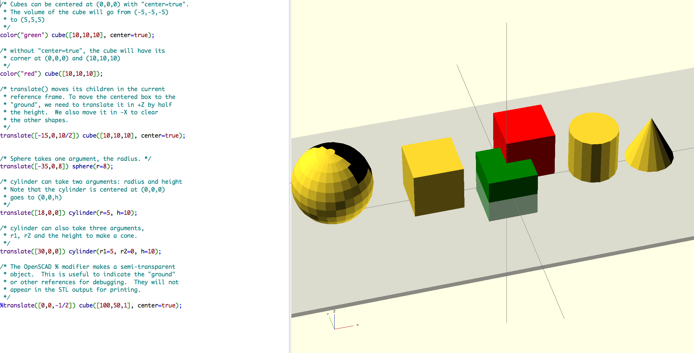

This is a demo of OpenSCAD for a tutorial class.

* [cube](00-cube.scad) -- the simplest hello world
* [shapes](01-shapes.scad) -- showing geometric primitives
* [operators](02-operators.scad) -- ``intersection`` and ``difference`` operators
* [loops](03-loops.scad) -- ``for`` loops and ``rotate``
* [modules](04-modules.scad) -- Using ``module`` to create "functions"

